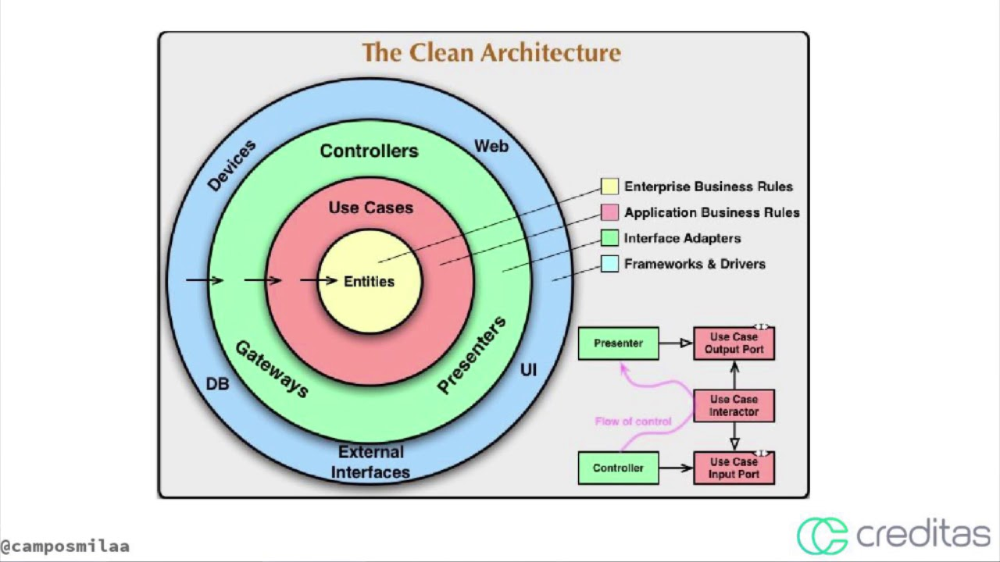
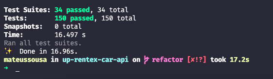

# **API RENTAL CAR**

[]

> ## EXECUCAO

- http://localhost:3333/docs

```
docker-compose up

```



> ## APIs

1. [Usuarios - Concluido]
1. [Upload Avatar AWS S3 - Concluido]
1. [Login - em desenvolvimento]
1. [Categorias de carros - em desenvolvimento]
1. [Carros - em desenvolvimento]
1. [Alugueis - em desenvolvimento]

> ## Princípios

- Single Responsibility Principle (SRP)
- Open Closed Principle (OCP)
- Liskov Substitution Principle (LSP)
- Interface Segregation Principle (ISP)
- Dependency Inversion Principle (DIP)

> ## Metodologias e Designs

- TDD
- Clean Architecture
- DDD
- GitFlow
- Modular Design
- Dependency Diagrams
- Use Cases
- Continuous Integration
- Continuous Delivery
- Continuous Deployment

> ## Bibliotecas e Ferramentas

- NPM
- Typescript
- Git
- Docker
- Jest
- Sequelize
- MySQL
- Sequelite
- SuperTest
- AWS

> ## Features do Typescript

- POO Avançado
- Interface
- TypeAlias
- Namespace
- Utility Types
- Modularização de Paths
- Configurações
- Build
- Deploy
- Uso de Breakpoints

> ## Features de Testes

- Testes Unitários
- Testes de Integração
- Cobertura de Testes
- Test Doubles
- Mocks
- Stubs
- Spies
- Fakes
